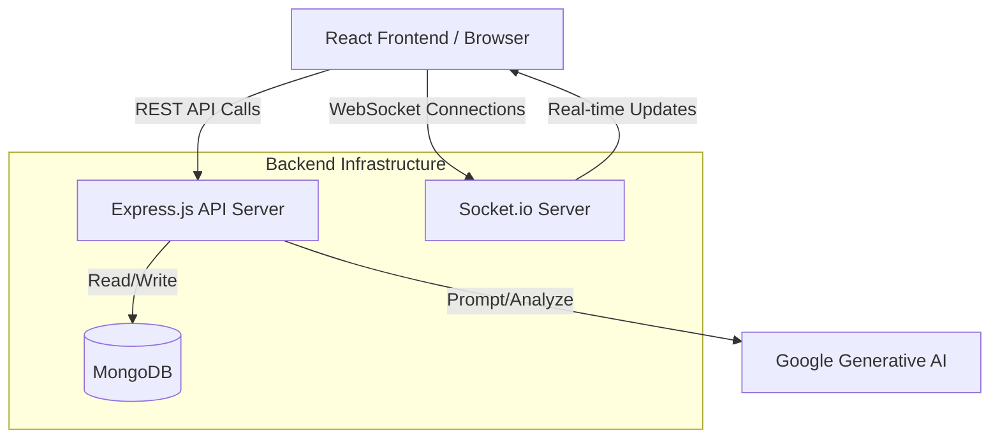

# 🌉 TalentBridge

> **A Next-Generation AI-Powered Recruitment Platform** connecting exceptional talent with world-class opportunities.

TalentBridge is a comprehensive, full-stack recruitment solution designed to streamline the hiring process for both employers and job seekers. Built with a robust **MERN stack** (MongoDB, Express, React, Node.js), it goes beyond simple job boards by integrating **Real-time Messaging**, **AI-driven insights**, **Live Code Assessments**, and **Automated Resume Parsing**.

---

## ✨ Key Features

### 🚀 For Job Seekers
- **Intelligent Job Discovery**: Advanced search and filtering to find the perfect role.
- **AI-Powered Applications**: Leverage Google's Generative AI to analyze resumes and generate tailored cover letters.
- **Skill Assessments**: Prove your coding skills with our integrated Monaco-based code editor and live execution environments.
- **Real-Time Communication**: Chat directly with recruiters using our low-latency Socket.io integration.
- **Dashboard & Analytics**: Track your application statuses and success rates in an intuitive dashboard.
- **PDF Resume Generation**: Automatically generate and export beautifully formatted resumes (PDFKit).

### 🏢 For Employers
- **Streamlined Job Posting**: Create and manage detailed job listings with rich text.
- **Automated Applicant Screening**: Parse applicant PDFs (pdf-parse) and use AI to match applicant skills against job requirements.
- **Interactive Technical Interviews**: Send and review coding assessments directly on the platform.
- **Applicant Tracking System (ATS)**: Kanban-style board to move candidates through the hiring pipeline (Applied, Interviewing, Offered, Rejected).
- **Company Branding**: Manage public-facing company profiles to attract top talent.

### 🔐 Platform Architecture & Security
- **Role-Based Access Control (RBAC)**: Secure routing and endpoints for `seeker`, `employer`, and `admin` roles.
- **JWT Authentication**: Stateless, secure authentication using HTTP-only cookies and Bearer tokens.
- **Premium UI/UX**: Designed with modern aesthetics, featuring glassmorphism, responsive layouts, and a curated dark mode.

---

## 🛠️ Technology Stack

| Layer | Technologies Used | Purpose |
|---|---|---|
| **Frontend** | React 19, React Router v7, Axios | Responsive SPA and routing |
| **Styling** | Vanilla CSS (Custom Design System) | High-performance, tailored aesthetics |
| **Code Editor** | `@monaco-editor/react` | Browser-based code assessments |
| **Backend** | Node.js, Express.js | High-concurrency RESTful API |
| **Database** | MongoDB, Mongoose | Flexible, schema-based NoSQL storage |
| **Real-Time** | Socket.io | Instant messaging and live notifications |
| **AI Integration** | `@google/generative-ai` | Resume parsing, matching, and generation |
| **PDF Processing**| `pdf-parse`, `pdfkit` | Reading and generating applicant resumes |
| **Authentication**| JSON Web Tokens (JWT), bcryptjs | Secure user sessions and password hashing |

---

## 🏗️ System Architecture

---

## 📂 Code Implementation & Structure

The codebase is organized using the **MVC (Model-View-Controller)** pattern on the backend, and a **Component-Based Architecture** on the frontend.

### Backend (`/server`)
- **Controllers**: Contain the core business logic (e.g., `jobController.js`, `assessmentController.js`).
- **Models**: Define the Mongoose schemas and relationships (`User`, `Job`, `Application`, `Message`, `Assessment`).
- **Middleware**: Handles JWT verification, role authorization, error handling, and Multer file uploads.
- **Routes**: Maps HTTP verbs to controller actions.
- **Socket**: Manages WebSockets for real-time chat between seekers and employers.

### Frontend (`/client`)
- **Context API**: Manages global application state (Authentication status, Socket connection).
- **Pages**: Top-level route components (`JobDetail.js`, `Dashboard.js`).
- **Components**: Reusable UI blocks (`ApplicationCard.js`, `ChatBox.js`, `CodeEditor.js`).
- **Services**: Abstracted Axios calls to interface cleanly with the backend API.

---

## 🚀 Cloud Deployment (Render)

This application is configured for a unified deployment on [Render.com](https://render.com), where the Node.js backend serves the React frontend statically.

1. **Database Setup**: Create a MongoDB Atlas cluster and obtain your connection URI.
2. **Environment Setup**: In Render, create a **Web Service** connected to your GitHub repo.
3. **Configuration**:
   - Build Command: `npm install`
   - Start Command: `npm start` (Executes `server.js` which handles the Heroku/Render postbuild to compile the React app).
4. **Environment Variables**:
   - `NODE_ENV=production`
   - `MONGO_URI=<Your MongoDB Atlas URI>`
   - `JWT_SECRET=<Your Secret Key>`
   - `JWT_EXPIRE=30d`

---

*Built with ❤️ to bridge the gap between talent and opportunity.*
